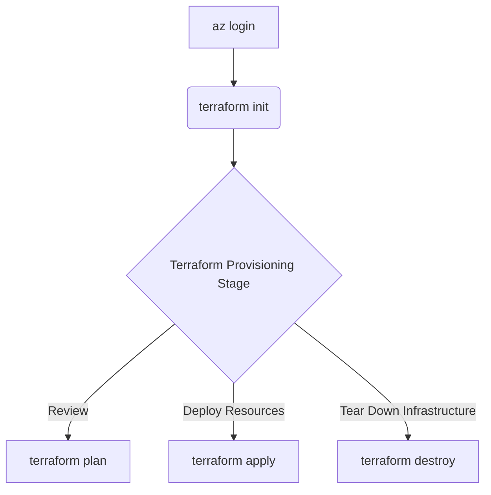

# Demonstration: Deploying Azure Resources for an ML Platform

Costa Rica

[](https://github.com/)  
[brown9804](https://github.com/brown9804)

Last updated: 2025-04-29

------------------------------------------

> This repository contains Terraform configurations for setting up an Azure Machine Learning workspace along with compute clusters and supportive resources to form the core of an ML platform.  
> `Remember, managing your infrastructure through code (IaC) not only ensures consistency, but also offers version control, reproducibility, and collaboration benefits—essential for scalable ML operations.`
> For additional Terraform templates covering various Azure services, check out [this repository](https://github.com/MicrosoftCloudEssentials-LearningHub/AzureTerraformTemplates-v0.0.0). Explore and borrow ideas as needed!

> [!TIP]
> **About Infrastructure via Terraform**: Terraform is a powerful IaC tool that enables you to define and provision your cloud resources through a high-level configuration language. This approach keeps not only your application objects under source control but also the infrastructure code, ensuring reproducible environments across development, testing, and production. Microsoft also offers additional IaC tools like Bicep and ARM templates, giving you flexibility in how you manage your Azure resources.

<p align="center">
    
</p>

<details>
<summary><b>List of References </b> (Click to expand)</summary>

- [Azure Machine Learning Documentation](https://learn.microsoft.com/en-us/azure/machine-learning/)
- [Terraform Azure Provider Documentation](https://registry.terraform.io/providers/hashicorp/azurerm/latest/docs)
- [Azure Terraform Templates](https://github.com/MicrosoftCloudEssentials-LearningHub/AzureTerraformTemplates-v0.0.0)
</details>

<details>
<summary><b>Table of Contents </b> (Click to expand)</summary>

- [Overview](#overview)
- [Configuring Access with Azure CLI](#configuring-access-with-azure-cli)
- [Configure Remote Storage for Terraform Deployment](#configure-remote-storage-for-terraform-deployment)
- [How to Execute the Deployment](#how-to-execute-the-deployment)
</details>

## Overview

```plaintext
.
├── README.md
├── src
│   ├── main.tf
│   ├── variables.tf
│   ├── provider.tf
│   ├── terraform.tfvars
│   ├── remote-storage.tf
│   └── outputs.tf
```

- **main.tf** *(Main Terraform configuration file)*: Contains the core infrastructure code that provisions your Azure Machine Learning workspace, compute clusters, and other related services.
- **variables.tf** *(Variable definitions)*: Defines variables to parameterize your configurations. This includes settings for workspace names, compute configurations, and other environment-specific parameters.
- **provider.tf** *(Provider configurations)*: Specifies the necessary settings for the Azure provider so Terraform can authenticate and manage your Azure resources.
- **terraform.tfvars** *(Variable values)*: Holds the actual values for the variables defined in `variables.tf`. Adjust these values according to the environment you’re targeting (development, staging, production).
- **remote-storage.tf** *(Remote state storage configuration)*: Configures a remote backend (such as Azure Blob Storage) for storing Terraform’s state file securely, ensuring reliable collaboration.
- **outputs.tf** *(Output values)*: Defines outputs to display resource endpoints, IDs, and other key details after a successful deployment.

## Configuring Access with Azure CLI

> To deploy Azure Machine Learning resources, proper authentication is required. In many cases, you might need to assign a service principal with the appropriate permissions.

To list available service principals, run:

```sh
az ad sp list --query "[].{Name:displayName, AppId:appId, ObjectId:id}" --output table
```

Below is an example showing how you would reference the service principal (whose Object ID you’ve retrieved) in your Terraform configuration:

```hcl
ml_service_principal_id = "12345678-1234-1234-1234-1234567890ab"
```

## Configure Remote Storage for Terraform Deployment

> For robust state management and collaboration, configuring a remote backend for Terraform is essential. This section outlines how to use Azure Blob Storage for remote state storage.

1. **Create an Azure Storage Account**:  
    - Use the Azure portal or CLI to set up a new storage account if you do not already have one.  
    - Note down the storage account name and access key.
2. **Create a Storage Container**:  
    - Within your storage account, create a container dedicated to holding your Terraform state file.
3. **Configure Terraform Backend**:  
    - In the `remote-storage.tf` file (located in the `src` folder), include the backend configuration to connect to your Azure Blob Storage container.

## How to Execute the Deployment



> [!IMPORTANT]
> Before executing, update `terraform.tfvars` with your personalized configuration values. This repository provisions an Azure Machine Learning workspace, compute clusters,
> and essential support resources for running ML experiments. A video walk-through is available that clearly explains the deployment steps.  <br/>
> *Note: Once your ML experiments are complete, remember to scale down compute clusters or delete the resource group to control costs.*

1. **Login to Azure**: Navigate to your Terraform directory and log in to your Azure account. This command opens a browser window for authentication.

    ```sh
    cd ./infrastructure/azMachineLearning/src/
    ```
    ```sh
    az login
    ```

   https://github.com/user-attachments/assets/aad4e0e6-46bb-457d-a768-0eedf6a9d2ba


2. **Initialize Terraform**: Set up your working directory and install the necessary provider plugins.
    ```sh
    terraform init
    ```

   https://github.com/user-attachments/assets/e56ed69c-7a82-48fd-ba72-bbd9f862175d

3. **Review the Deployment Plan**: Preview the changes Terraform will make.
    ```sh
    terraform plan -var-file terraform.tfvars
    ```

    https://github.com/user-attachments/assets/bf2faa70-7ee4-4722-9e21-024873a75ac7

4. **Apply the Configuration**: Deploy the specified Azure resources.

    ```sh
    terraform apply -var-file terraform.tfvars
    ```

   

5. **Destroy the Infrastructure (if needed)**: Clean up resources by tearing down the deployment.
    ```sh
    terraform destroy -var-file terraform.tfvars
    ```

<div align="center">
  <h3 style="color: #4CAF50;">Total Visitors</h3>
  
</div>
